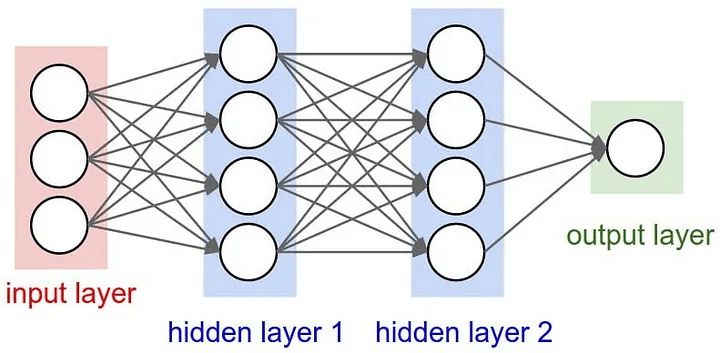

# AlphaQuoridor


In Japan, the board game Quoridor is not well-known. This article applies AlphaZero, a powerful deep reinforcement learning method, to Quoridor. Despite its simple design, AlphaZero has demonstrated the ability to outperform professional players in games like Go and Shogi. The goal is to deepen understanding of both the theoretical and practical aspects of AlphaZero through this application.

## What is Quoridor?
According to Wikipedia, Quoridor is a French abstract board game where players aim to reach the opposite side of the board by moving their pieces and placing walls.

[Quoirdor — Wikipedia](https://en.wikipedia.org/wiki/Quoridor)  

The setup and rules are as follows:

- Setup: For two players, each starts at opposite ends of the board and has ten walls. For four players, each starts in their own corner with five walls.
- Gameplay: Players take turns either moving their piece one square in any direction or placing a wall on the board. Pieces can jump over other pieces but cannot cross walls. Walls cannot completely block a player’s path.
- Winning: The first player to reach the opposite side wins.
  
The simple rule that walls cannot completely block paths makes the game exciting until the end.

## Theory of AlphaZero
AlphaZero [1, 2] combines deep learning, search, and reinforcement learning. Let’s explore each component:

### Deep Learning:


AlphaZero uses deep learning for intuition, similar to how professional players think about their best moves. It employs ResNet [3], a convolutional neural network used in image analysis. The game board, like an image, is a 2D array of information. The network can be represented as:

$$
\mathrm{ResNet(s)} = \pi(a|s), v(s)
$$

where s is the game state, $\pi(a∣s)$ is the policy (probability of action a given state $s$), and $v(s)$ is the value ($+1$ if win,$-1$ if loss) of state $s$.

### Search:


Games like Shogi, Go, Othello, and Quoridor are two-player zero-sum games with perfect information. The optimal strategy can be found using the minimax method, but it is impractical due to the large number of possible moves. Instead, AlphaZero uses Monte Carlo Tree Search (MCTS) to predict future moves.

MCTS decides the next move based on the Upper Confidence Bound (UCB) value:

$$
\mathrm{UCB}(s,a) = Q(s,a) + c\,\pi(a \mid s)\, \frac{\sqrt{N(s)}}{1 + N(s,a)}
$$

$$
Q(s,a) = \frac{1}{N(s,a)} \sum_{i=1}^{N(s,a)} v_i\!\bigl(s \xrightarrow{\,a\,} s'\bigr)
$$


where $Q(s,a)$ is the value estimate of action a in state $s$, averaged over the number of simulations $N(s,a)$ transitioning from state $s$ to $s^\prime$. $N(s)$ is the total number of simulations for state $s$. The first term of the equation emphasizes exploiting high-value actions, while the second term focuses on exploring actions that haven’t been simulated much, balanced by the hyperparameter $c$.

By repeating simulations, actions with higher $N(s,a)$ become valuable moves.

In practice, the action $a$ to be taken in a given state $s$ is determined by the probability $\pi(a∣s)$, weighted by the Boltzmann distribution with temperature $T$.

$$
\pi(a \mid s) \;=\; \frac{N(s,a)^{1/T}} {\displaystyle \sum_{b} N(s,b)^{1/T}}.
$$

### Reinforcement Learning:


AlphaZero generates training data through self-play, updating ResNet parameters with this experience to create a more intelligent neural network. The process involves:

1. Initializing ResNet parameters.
2. Obtaining experience data through self-play.
3. Updating ResNet parameters with the experience data.
4. Repeating steps 2 and 3 multiple times.


## Implementation of AlphaQuoridor
1. Game design (`game.py`)
2. Deep learning implementation with ResNet (`dual_network.py`)
3. Monte Carlo Tree Search implementation (`pv_mcts.py`)
4. Data collection through self-play (`self_play.py`)
5. Updating ResNet parameters (`train_network.py`)
6. Comparing and updating the best parameters (`evaluate_network.py`)
7. Evaluating the best player (`evaluate_best_player.py`)
8. Running the entire training cycle (`train_cycle.py`)
9. Implementing a game UI to play against the AI (`human_play.py`)

This project references the Japanese book “AlphaZero: Deep Learning, Reinforcement Learning, and Search” for detailed explanations.

[AlphaZero: Deep Learning, Reinforcement Learning, and Search](https://www.borndigital.co.jp/book/14383/)

Due to the short training time, the game was trained on a 3x3 board. While this isn’t very exciting gameplay-wise, the implementation allows for easy adjustment to larger board sizes, such as the actual 9x9 size, which would demonstrate the reinforcement learning capabilities better.

The actual gameplay screen when running `human_play.py` looks like this. The number of walls for both the player and the enemy (AI) is set to one, matching the game size. To place a wall, click "Place Wall" below, select the vertical or horizontal direction, and then click the desired location (red grid points).

### Initial state


### Mid-game


### End-game scenarios for winning


### End-game scenarios for losing


The AI wasn’t very strong this time due to the limited training time. However, with a longer training period, a stronger AI could be developed.


## Summary
This article applied AlphaZero to the lesser-known Quoridor board game. AlphaZero can be adapted to any two-player zero-sum game with perfect information by modifying the game design. This could be an interesting project to see how strong an AI can be created for different games. If you enjoyed this article, please like it, and stay tuned for more articles.


## References
[1] [D. Silver et al., “Mastering Chess and Shogi by Self-Play with a General Reinforcement Learning Algorithm”](https://arxiv.org/abs/1712.01815)

[2] [D. Silver et al., “A General Reinforcement Learning Algorithm That Masters Chess, Shogi, and Go through Self-Play”](https://www.science.org/doi/10.1126/science.aar6404)

[3] [K. He, X. Zhang, S. Ren, and J. Sun, “Deep Residual Learning for Image Recognition”](https://arxiv.org/abs/1512.03385)


## Getting Started

### Requirements

- Python 3.x
- Libraries specified in `requirements.txt` (e.g., TensorFlow or PyTorch, NumPy, etc.)

### Installation

Clone the repository and install the dependencies:

```bash
git clone https://github.com/dorakingx/AlphaQuoridor.git
cd AlphaQuoridor
pip install -r requirements.txt
```

### Usage

#### Training the AI

To run the complete training cycle, execute:

```bash
python train_cycle.py
```
This script will handle data collection through self-play, update the network parameters, and evaluate model improvements.

#### Playing Against the AI
To play a game against the trained AI, run:

```
python human_play.py
```
This launches the game UI, allowing you to challenge the AI directly.
